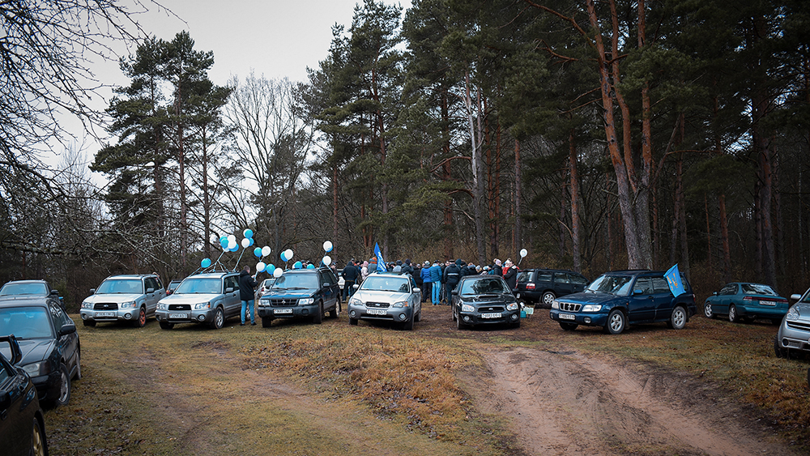
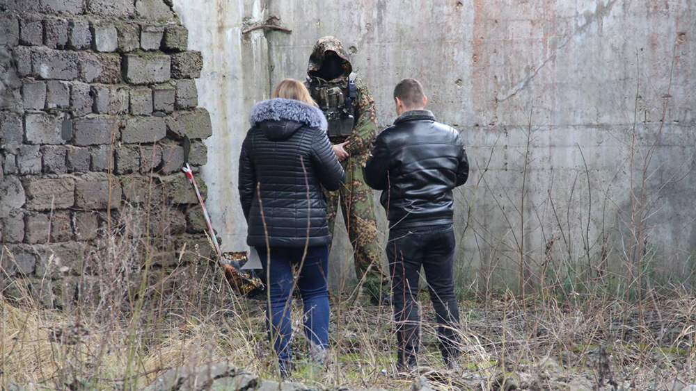
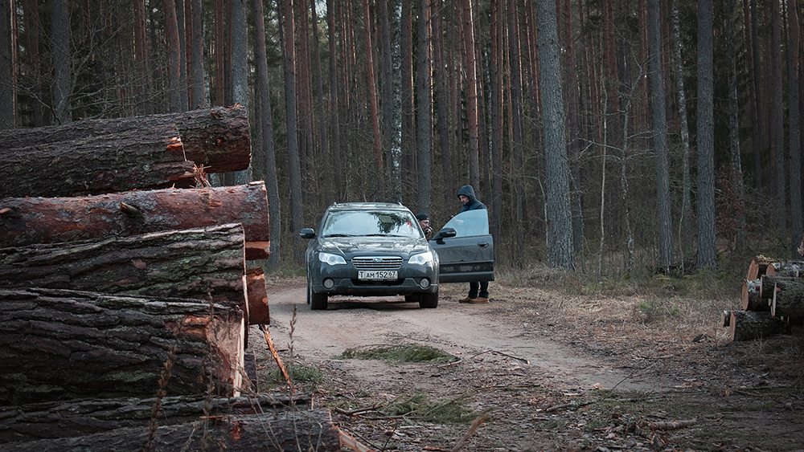
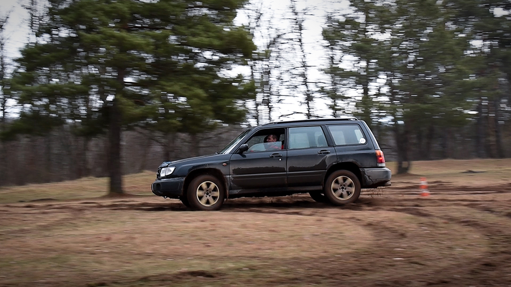
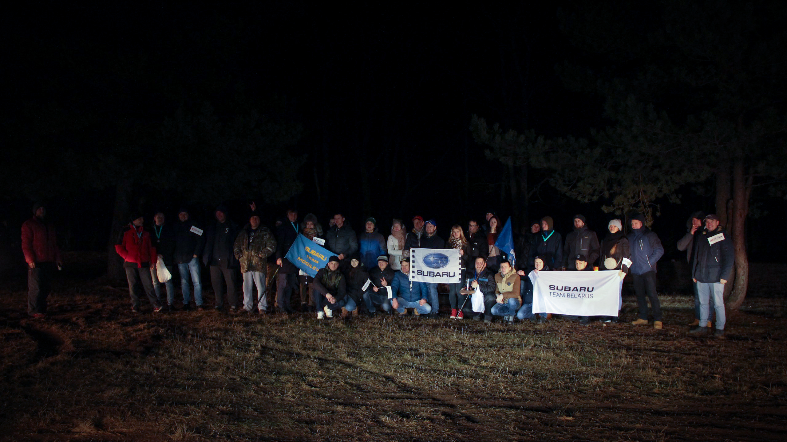

Мы уверены, что вы слышали о том, что в Витебске 25 января прошёл слёт субаристов, приуроченный ко Дню Рождения витебского клуба SUBARU. Поэтому мы очень хотим поделиться информацией с теми, кто там не был. Также мы сделали короткий видеоотчёт и надеемся, что он вам понравится!

<YouTube link="https://www.youtube.com/embed/9_hW-7NEWh4" />

## Начало мероприятия

Всё началось со сбора на поляне в д. Малые Лётцы. Первым делом был проведён инструктаж, объявлена программа мероприятия и дальнейшие действия всех участников. Сразу после небольшой беседы, водители получили свои порядковые номера участника и отправились в путь.

<figure>

  

  <figcaption>Автор фотографии: Павел Кейзик</figcaption>
</figure>

## Ориентирование на местности

Маршрут содержал в себе 7 контрольных точек, часть из которых были развлекательными. На второй точке, «Cтарый паромщик», нужно было по дереву преодолеть водоём, отдать выданный на старте ключ и вернуться обратно. На точке, под названием «Убежище сталкера», вас ожидала интеллектуальная игра, после которой вы получали дальнейшие координаты. На 6-ой точке вы попадаете на тропу истинного субариста, проходя по которой можно было найти различные запчасти, возможно даже от вашего автомобиля.

<figure>

  

  <figcaption>Автор фотографии: Павел Комаров</figcaption>
</figure>

## Ралли

После небольшого перерыва, начинаются заезды в ралли. Субаристов ожидал участок длинною в 4 км, с красивыми видами и скоростной трассой.

<figure>

  

  <figcaption>Автор фотографии: Павел Кейзик</figcaption>
</figure>

## Джимхана

Последним испытанием для автомобилей стала джимхана. Задача водителей была не только пройти участок как можно быстрее, но и сделать это как можно зрелищнее. Ведь была возможность забрать приз зрительских симпатий.

<figure>

  

  <figcaption>Автор фотографии: Павел Кейзик</figcaption>
</figure>

## А как прошёл вечер после гонок?

По завершению всех активностей и праздничного салюта, мы, дружной колонной, отправились на турбазу «Энергетик», где нас ожидала сауна, интеллектуальные игры с подарками и награждение победителей в различных номинациях.

<figure>

  

  <figcaption>Автор фотографии: Павел Комаров</figcaption>
</figure>

## Где посмотреть фотографии?

Уже по давней традиции, после каждого мероприятия, мы создаём <a href="https://vk.com/album-75289878_269927418" target="_blank">фотоальбом</a> в нашей группе ВКонтакте, где вы можете поделиться со всеми вашими фотографиями и эмоциями.

