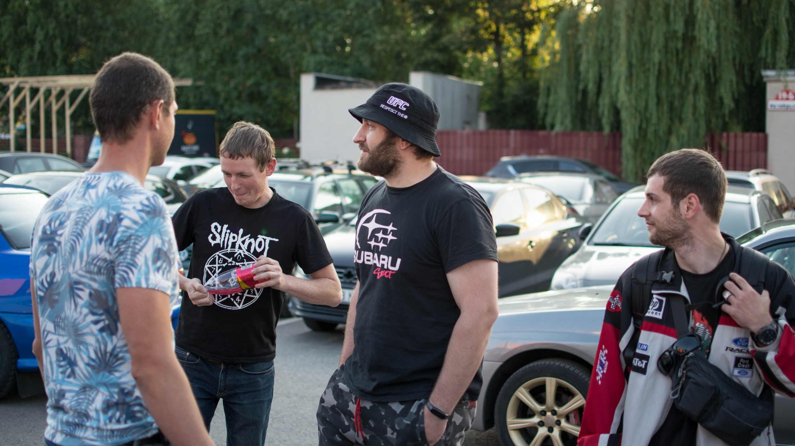
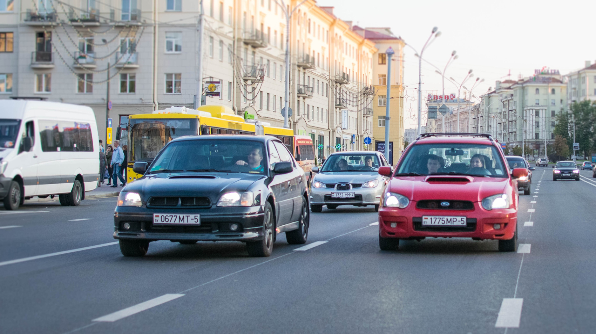
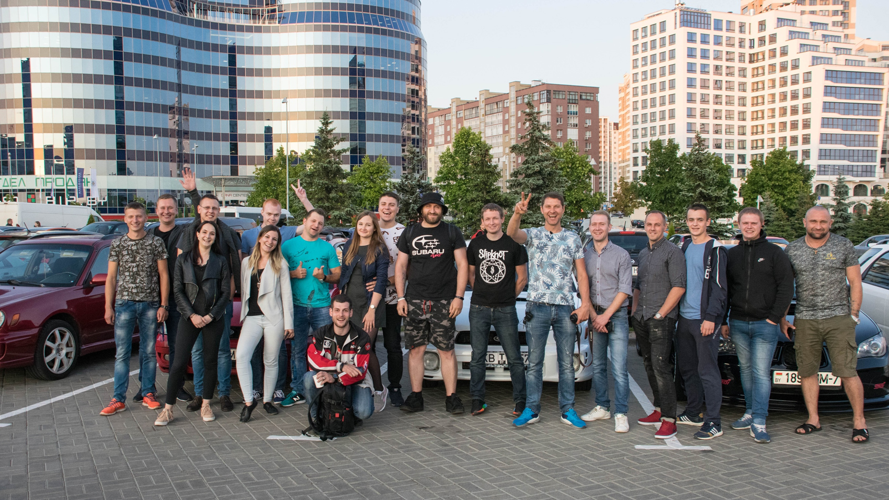

Возможно вы уже слышали об этой новости, а возможно даже и нет. Поэтому мы очень хотим рассказать поподробнее о данном событии в нашей небольшой статье. Читайте до конца, так как ниже вас ждёт видеоотчёт.

## Предыстория

Прошедшим летом (Июль 2019), наши друзья из <a href="https://www.youtube.com/channel/UCGBgT1ttVVq4RIZbo9hp_LA" target="_blank">SubaruSect</a> приехали в Беларусь, с целью посетить автофестиваль SunDay 2019 в г. Гродно, но решили заглянуть и в столицу нашей страны. Вечером, 19 июля 2019, мы собрали сходку, встретили ребят и провели небольшую экскурсию по нашему городу.

Начало встречи прошло на всем известной улице Октябрьская, где и была запланирована встреча с SubaruSect. Именно здесь прошла первая беседа с ребятами, знакомство и обмен наклейками.

<figure>

  

  <figcaption>Автор фотографии: Роман Свистун</figcaption>
</figure>

## Выехали в город

Спустя некоторое время, поступило предложение прокатиться по городу и заодно показать достопримечательности города нашим гостям. Но так как времени у нас было не очень много, потому что впереди нас ждали гонки, то мы решили проложить маршрут через Национальную библиотеку Беларуси.

<figure>

  

  <figcaption>Автор фотографии: Павел Кейзик</figcaption>
</figure>

По приезду на парковку, возле библиотеки, мы как всегда решили поболтать, ну и пока ещё светит солнышко, сделать общее фото, на память. После чего мы поднялись на обзорную площадку, где показали и рассказали ребятам про видимую часть города, сделали пару фотографий и прошлись по выставочной галерее.

<figure>

  

  <figcaption>Автор фотографии: Роман Свистун</figcaption>
</figure>

## Завершение вечера

Ну и в завершении вечера, нас ждали свободные заезды на 1/4 мили на полигоне «Липки». Ребята сделали крутые кадры, записали небольшое интервью с одной из наших субаристок, за что им отдельное спасибо. Ну и самое главное, что они остались довольны поездкой в Минск и хотят приехать сюда ещё раз, ну а мы их обязательно встретим.

Ниже вы сможете найти то самое видео, с канала <a href="https://www.youtube.com/channel/UCGBgT1ttVVq4RIZbo9hp_LA" target="_blank">SubaruSect</a>, где записан отчёт о поездке в Беларусь.

<!-- <YouTube link="PASTE_EMBEDE_LINK_TO_VIDEO" /> -->
