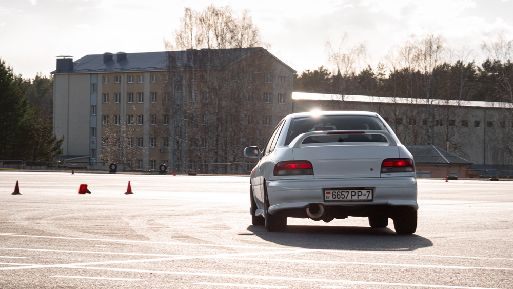

Уже прошло больше месяца, как огромное количество людей, по всему миру, борется с вирусом. Уверены, что вы уже знакомы с тем, как себя вести, что можно делать, а что не стоит, поэтому перейдём сразу к более интересным вещам.

## Да ничего страшного, всего лишь ОРВИ

Мы тоже так думали, поэтому продолжали проводить наши сходки. Как бы это странно не звучало, но приезжать стало гораздо больше людей... На одной из сходок нас собралось достаточно много, поэтому мы прокатились по проспекту, записали видео и повеселили прохожих. Ниже можно посмотреть, как прошла наша встреча. Да, было весело!

<YouTube link="https://www.youtube.com/embed/tXPpl3GTKKc" />

## Первый четверг месяца. Пропустим сходку на ТЦ ALL?

Нет, конечно же сходку на ТЦ ALL мы не пропустили, было прохладно, но с нами была мобильная кофейня, поэтому даже ветер нас не испугал. Снова приехало немало людей и, по традиции, к нам приехали новые ребята, чтобы познакомиться с нами поближе. Разъезжаясь по домам, что-то пошло не так и мы сняли ещё одно видео с покатушками, но уже с меньшим количеством участников.

<YouTube link="https://www.youtube.com/embed/7FvgTXYbz-M" />

## На этом сходки закончились...

К сожалению, в связи с ухудшением ситуации по стране и миру, было принято решение временно прекратить наши сборы. Поэтому теперь мы сидим дома, пьём горячий чаёк с лимоном и читаем эту статью. Но погодите! Не просто же так мы начали писать статью? Да, у нас для вас есть ещё кое-что.

Все уйти на карантин, к сожалению, не смогли. Остались те самые субаристы, готовые к гонкам и соревнованиям при любых условиях. Поэтому каждые выходные, и даже чаще, наши субаристы посещают Time Attack в Липках, улучшают своё время круга и проводят время с пользой.

<figure>

  

  <figcaption>Автор фотографии: Павел Кейзик</figcaption>
</figure>

Конечно же мы подумали о вас и сделали пару фотографий, которые можно посмотреть в альбомах ниже:

- <a href="https://vk.com/album-75289878_271270199" target="_blank">Time Attack 28 марта</a>
- <a href="https://vk.com/album-75289878_271476970" target="_blank">Time Attack 4 апреля</a>
- <a href="https://vk.com/album-75289878_271522289" target="_blank">Time Attack 8 апреля</a>

Но это ещё не всё! Мы записали видео, где можно посмотреть, что же всё-таки творят субаристы и другие клубы, пока у остальных карантин.

<YouTube link="https://www.youtube.com/embed/8I-jSLoijzM" />

## Заключение

Берегите себя и своё здоровье! Ну а если вы не боитесь вируса, то хотя бы обходите стороной тех, кто в масках. Надеемся, что эпидемия скоро пройдёт и мы снова встретимся с вами в большом семейном кругу!
